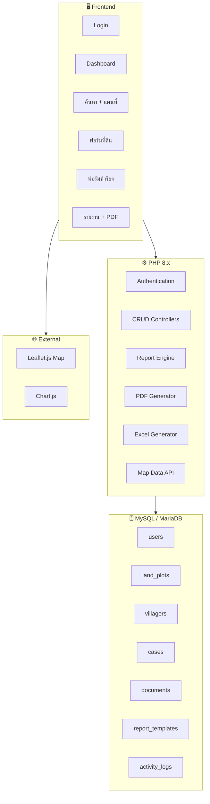
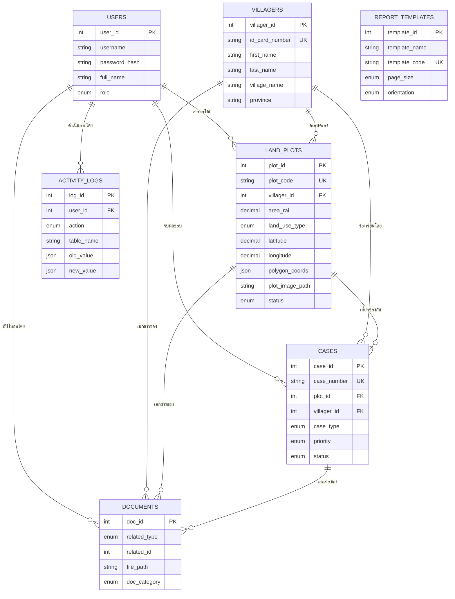

# ระบบจัดการปัญหาที่ดินทำกินในเขตอุทยานแห่งชาติ
# National Park Land Management System (v2)

---

## 📊 สถานะความคืบหน้า

| Phase | สถานะ | รายละเอียด |
|-------|--------|------------|
| Phase 0: Environment | 🟡 **กำลังทำ** | เชื่อม Symbolic Link, Import Database, เช็ค PHP Config |
| Phase 1: Foundation | ✅ **เสร็จ** | โครงสร้าง, DB, Auth, Layout, CSS, Dashboard, Map UI |
| Phase 2: Core Data | ✅ **เสร็จ** | CRUD ราษฎร/แปลง/คำร้อง/ผู้ใช้, อัปโหลดเอกสาร, API |
| Phase 3: Map Integration | ✅ **เสร็จ** | Leaflet.js, Marker, Polygon, ค้นหา, Popup |
| Phase 4: Reports & PDF | ✅ **เสร็จ** | ReportController + Preview + 10 reports + Excel export |
| Phase 5: Case & Dashboard | ✅ **เสร็จ** | CRUD คำร้อง + Dashboard (รวมใน Phase 1-2) |
| Phase 6: Polish & Deploy | 🚀 รอเริ่ม | Responsive, Testing, Deploy |

> **ไฟล์ทั้งหมด**: 32 PHP + 1 CSS + 1 JS + 1 SQL = **35 ไฟล์**

---

## 🛠️ การตั้งค่าสภาพแวดล้อม (Environment Setup)

หากย้ายมาเครื่องใหม่หรือลง XAMPP ใหม่ ให้ปฏิบัติตามขั้นตอนดังนี้:

### 1. เชื่อมต่อโฟลเดอร์โปรเจกต์ (Symbolic Link)
รัน CMD ด้วยสิทธิ์ **Administrator** แล้วใช้คำสั่ง:
```cmd
mklink /D "C:\xampp\htdocs\PHP_SQL" "C:\Users\This PC\OneDrive\000_Ai Project\PHP_SQL"
```

### 2. นำเข้าฐานข้อมูล (Import Database)
1. เปิด **XAMPP Control Panel** และ Start **MySQL**
2. เข้าไปที่ [http://localhost/phpmyadmin/](http://localhost/phpmyadmin/)
3. สร้างฐานชื่อ `land_management` (หรือปล่อยว่างไว้ถ้าไฟล์ SQL มีคำสั่งสร้างให้)
4. เลือกแท็บ **Import** และเลือกไฟล์ `sql/schema.sql` ในโฟลเดอร์โปรเจกต์
5. กด **Import** ด้านล่างสุด

### 3. ตรวจสอบการเชื่อมต่อ
ตรวจสอบไฟล์ [database.php](file:///c:/Users/This%20PC/OneDrive/000_Ai%20Project/PHP_SQL/config/database.php) ว่า `DB_USER` และ `DB_PASS` ตรงกับ XAMPP (ปกติคือ root / ไม่มีรหัสผ่าน)

---

## บทนำ (Background)

ราษฎรจำนวนมากอาศัยและทำกินในพื้นที่ก่อนประกาศเขตอุทยานแห่งชาติ ทำให้เกิดปัญหาซ้อนทับระหว่าง **สิทธิการใช้ที่ดินของชาวบ้าน** กับ **ขอบเขตเขตอนุรักษ์** ระบบนี้ช่วยให้ **เจ้าหน้าที่** สามารถ:

- **บันทึก แก้ไข และค้นหา** ข้อมูลแปลงที่ดินทำกินของราษฎร
- **สร้างรายงานหลากหลายแบบฟอร์ม** และสั่งพิมพ์เป็น PDF
- **ดูแผนที่แปลงที่ดิน** เมื่อค้นหาข้อมูลราษฎร
- **นำออกข้อมูล** เป็น Excel เพื่อส่งต่อหน่วยงานอื่น

> [!IMPORTANT]
> **ผู้ใช้หลัก**: เจ้าหน้าที่อุทยานฯ ที่ต้องบันทึก แก้ไข และนำออกข้อมูล
> **ฐานข้อมูล**: SQL (MySQL/MariaDB) เน้นความเร็วในการค้นหา

---

## สถาปัตยกรรมระบบ (System Architecture)



---

## โมดูลทั้งหมด (8 Modules)

---

### 📦 Module 1: ระบบผู้ใช้งาน (User Management)

> เน้นเจ้าหน้าที่เป็นหลัก — ไม่มีการลงทะเบียนเอง ต้องให้ Admin สร้างให้

| ฟีเจอร์ | รายละเอียด |
|---------|-----------|
| Login/Logout | Username + Password (hashed) |
| บทบาท (Roles) | **Admin** = จัดการทุกอย่าง + สร้าง User |
| | **Officer** = บันทึก/แก้ไข/ค้นหา/นำออก |
| | **Viewer** = ดูข้อมูล + พิมพ์รายงานเท่านั้น |
| Session | PHP Session + Remember me |

#### ตาราง `users`
```sql
CREATE TABLE users (
    user_id       INT AUTO_INCREMENT PRIMARY KEY,
    username      VARCHAR(50) UNIQUE NOT NULL,
    password_hash VARCHAR(255) NOT NULL,
    full_name     VARCHAR(100) NOT NULL,
    role          ENUM('admin','officer','viewer') DEFAULT 'officer',
    phone         VARCHAR(15),
    is_active     TINYINT(1) DEFAULT 1,
    last_login    DATETIME,
    created_at    DATETIME DEFAULT CURRENT_TIMESTAMP
);
```

---

### 📦 Module 2: ทะเบียนราษฎร (Villager Registry)

#### ตาราง `villagers`
```sql
CREATE TABLE villagers (
    villager_id    INT AUTO_INCREMENT PRIMARY KEY,
    id_card_number VARCHAR(13) UNIQUE NOT NULL,
    prefix         VARCHAR(20),
    first_name     VARCHAR(100) NOT NULL,
    last_name      VARCHAR(100) NOT NULL,
    birth_date     DATE,
    phone          VARCHAR(15),
    address        TEXT,
    village_no     VARCHAR(10),
    village_name   VARCHAR(100),
    sub_district   VARCHAR(100),
    district       VARCHAR(100),
    province       VARCHAR(100),
    photo_path     VARCHAR(500),
    notes          TEXT,
    created_by     INT,
    created_at     DATETIME DEFAULT CURRENT_TIMESTAMP,
    updated_at     DATETIME DEFAULT CURRENT_TIMESTAMP ON UPDATE CURRENT_TIMESTAMP,
    FOREIGN KEY (created_by) REFERENCES users(user_id),
    INDEX idx_id_card (id_card_number),
    INDEX idx_name (first_name, last_name)
);
```

> [!NOTE]
> เพิ่ม **INDEX** ที่ `id_card_number` และ `first_name, last_name` เพื่อให้ค้นหาเร็วขึ้น

---

### 📦 Module 3: ทะเบียนแปลงที่ดินทำกิน (Land Plot Registry)

#### ตาราง `land_plots`
```sql
CREATE TABLE land_plots (
    plot_id          INT AUTO_INCREMENT PRIMARY KEY,
    plot_code        VARCHAR(20) UNIQUE NOT NULL,
    villager_id      INT NOT NULL,
    park_name        VARCHAR(100),
    zone             VARCHAR(50),
    area_rai         DECIMAL(10,2) DEFAULT 0,
    area_ngan        DECIMAL(10,2) DEFAULT 0,
    area_sqwa        DECIMAL(10,2) DEFAULT 0,
    land_use_type    ENUM('agriculture','residential','garden','livestock','mixed','other') DEFAULT 'agriculture',
    crop_type        VARCHAR(200),
    latitude         DECIMAL(10,7),
    longitude        DECIMAL(10,7),
    polygon_coords   JSON,
    occupation_since YEAR,
    has_document     TINYINT(1) DEFAULT 0,
    document_type    VARCHAR(50),
    status           ENUM('surveyed','pending_review','temporary_permit','must_relocate','disputed') DEFAULT 'pending_review',
    survey_date      DATE,
    surveyed_by      INT,
    plot_image_path  VARCHAR(500),
    notes            TEXT,
    created_at       DATETIME DEFAULT CURRENT_TIMESTAMP,
    updated_at       DATETIME DEFAULT CURRENT_TIMESTAMP ON UPDATE CURRENT_TIMESTAMP,
    FOREIGN KEY (villager_id) REFERENCES villagers(villager_id),
    FOREIGN KEY (surveyed_by) REFERENCES users(user_id),
    INDEX idx_plot_code (plot_code),
    INDEX idx_villager (villager_id),
    INDEX idx_status (status),
    INDEX idx_coords (latitude, longitude)
);
```

**ฟิลด์พิเศษ:**
- `polygon_coords` (JSON): เก็บพิกัดหลายจุดของขอบเขตแปลง เพื่อวาดรูปร่างแปลงบนแผนที่
- `plot_image_path`: รูปแปลงที่ดินรายแปลง (ภาพถ่ายทางอากาศ/สำรวจ)
- `crop_type`: ประเภทพืชที่ปลูก (เช่น ข้าวโพด, มันสำปะหลัง, ยางพารา)

---

### 📦 Module 4: ระบบจัดการเรื่อง/คำร้อง (Case Management)

#### ตาราง `cases`
```sql
CREATE TABLE cases (
    case_id       INT AUTO_INCREMENT PRIMARY KEY,
    case_number   VARCHAR(20) UNIQUE NOT NULL,
    plot_id       INT,
    villager_id   INT NOT NULL,
    case_type     ENUM('complaint','request_use','trespass_report','renewal','other') NOT NULL,
    subject       VARCHAR(200) NOT NULL,
    description   TEXT,
    priority      ENUM('high','medium','low') DEFAULT 'medium',
    status        ENUM('new','in_progress','awaiting_approval','closed','rejected') DEFAULT 'new',
    assigned_to   INT,
    resolution    TEXT,
    resolved_date DATE,
    created_by    INT,
    created_at    DATETIME DEFAULT CURRENT_TIMESTAMP,
    updated_at    DATETIME DEFAULT CURRENT_TIMESTAMP ON UPDATE CURRENT_TIMESTAMP,
    FOREIGN KEY (plot_id) REFERENCES land_plots(plot_id),
    FOREIGN KEY (villager_id) REFERENCES villagers(villager_id),
    FOREIGN KEY (assigned_to) REFERENCES users(user_id),
    FOREIGN KEY (created_by) REFERENCES users(user_id),
    INDEX idx_case_status (status),
    INDEX idx_case_type (case_type)
);
```

---

### 📦 Module 5: คลังเอกสาร (Document Storage)

#### ตาราง `documents`
```sql
CREATE TABLE documents (
    doc_id        INT AUTO_INCREMENT PRIMARY KEY,
    related_type  ENUM('villager','plot','case') NOT NULL,
    related_id    INT NOT NULL,
    file_name     VARCHAR(255) NOT NULL,
    file_path     VARCHAR(500) NOT NULL,
    file_type     VARCHAR(10),
    file_size     INT,
    doc_category  ENUM('id_copy','map','photo','permit','survey_form','boundary_image','other') NOT NULL,
    description   VARCHAR(200),
    uploaded_by   INT,
    uploaded_at   DATETIME DEFAULT CURRENT_TIMESTAMP,
    FOREIGN KEY (uploaded_by) REFERENCES users(user_id),
    INDEX idx_related (related_type, related_id)
);
```

---

### 📦 Module 6: ระบบแผนที่ (Map Module) 🗺️ — ใหม่!

แสดงแผนที่เชื่อมกับการค้นหา เมื่อค้นชื่อหรือเลขบัตร จะแสดงตำแหน่งแปลงบนแผนที่ทันที

#### เทคโนโลยี: **Leaflet.js** (ฟรี, Open Source)

```
┌──────────────────────────────────────────────────────────────────┐
│  🔍 ค้นหา: [เลขบัตร / ชื่อ / รหัสแปลง]         [ค้นหา]       │
├──────────────────────────┬───────────────────────────────────────┤
│                          │                                       │
│  📋 ผลการค้นหา           │     🗺️ แผนที่                        │
│                          │                                       │
│  ┌──────────────────┐    │   ┌───────────────────────────────┐   │
│  │ นาย สมชาย ใจดี   │ ◀──│──►│  📍 แปลง NP-001              │   │
│  │ 1-3401-xxxxx-xx  │    │   │  ┌─────────────┐             │   │
│  │ แปลง NP-001      │    │   │  │  ////อ/////  │ ← รูปแปลง   │   │
│  │ 5 ไร่ 2 งาน      │    │   │  │  //แปลง////  │             │   │
│  │ 📌 ดูบนแผนที่     │    │   │  └─────────────┘             │   │
│  └──────────────────┘    │   │                               │   │
│                          │   │  📍 แปลง NP-002              │   │
│  ┌──────────────────┐    │   │                               │   │
│  │ นาง สมหญิง ดีใจ  │    │   └───────────────────────────────┘   │
│  │ แปลง NP-002      │    │                                       │
│  └──────────────────┘    │   [ดาวเทียม] [แผนที่ปกติ] [ภูมิประเทศ]│
├──────────────────────────┴───────────────────────────────────────┤
│  📸 รูปแปลงที่ดิน #NP-001                                       │
│  ┌────────┐ ┌────────┐ ┌────────┐                               │
│  │ ภาพ 1  │ │ ภาพ 2  │ │ ภาพ 3  │  ← รูปรายแปลง                │
│  └────────┘ └────────┘ └────────┘                               │
└──────────────────────────────────────────────────────────────────┘
```

**ฟีเจอร์แผนที่:**
| ฟีเจอร์ | คำอธิบาย |
|---------|---------|
| 📍 Pin แปลง | แสดง Marker ตำแหน่งแปลงจากพิกัด Lat/Lng |
| 🔷 วาดขอบเขต | วาด Polygon ของแปลงจาก `polygon_coords` (JSON) |
| 📸 Popup รูป | คลิก Marker → แสดงรูปแปลง + ข้อมูลย่อ |
| 🎨 สีตามสถานะ | สีเขียว = อนุญาต, เหลือง = รอตรวจ, แดง = ต้องอพยพ |
| 🔍 ค้นหาเชื่อม | พิมพ์ค้นหา → แผนที่ Zoom ไปแปลงนั้นทันที |
| 🗺️ Base Layer | สลับได้: ดาวเทียม, แผนที่ถนน, ภูมิประเทศ |
| 📐 วัดพื้นที่ | เครื่องมือวัดระยะ/พื้นที่บนแผนที่ |

---

### 📦 Module 7: ระบบรายงาน + PDF 📄 — ใหม่!

> [!IMPORTANT]
> ผู้ใช้ต้องการรายงานหลากหลายแบบฟอร์ม พร้อมสั่งพิมพ์เป็น PDF — นี่คือส่วนที่สำคัญมาก

#### เทคโนโลยี: **DomPDF** หรือ **TCPDF** (PHP Library สร้าง PDF)

#### แบบฟอร์มรายงานที่วางแผนไว้:

| # | ชื่อรายงาน | เนื้อหา | รูปแบบ |
|---|-----------|---------|--------|
| 1 | **บัญชีรายชื่อราษฎร** | ทะเบียนรายชื่อทั้งหมด พร้อมที่อยู่ | ตาราง → PDF/Excel |
| 2 | **ทะเบียนแปลงที่ดินทำกิน** | รายแปลง: รหัส, เจ้าของ, พื้นที่, สถานะ | ตาราง → PDF/Excel |
| 3 | **รายงานสำรวจรายแปลง** | ข้อมูลแปลงเดี่ยว + รูปแปลง + แผนที่ (แบบฟอร์ม 1 หน้าต่อแปลง) | ฟอร์ม → PDF |
| 4 | **สรุปพื้นที่ตามโซน** | จำนวนแปลง + พื้นที่รวม แยกตามโซนอุทยาน | ตาราง+กราฟ → PDF |
| 5 | **สรุปพื้นที่ตามประเภทการใช้** | เกษตร/อยู่อาศัย/สวน/เลี้ยงสัตว์ รวมพื้นที่ | ตาราง+กราฟ → PDF |
| 6 | **รายงานสถานะคำร้อง** | สรุปรายเดือน/ปี จำนวนเรื่องแยกตามสถานะ | ตาราง → PDF/Excel |
| 7 | **รายงานคำร้องรายเรื่อง** | รายละเอียดคำร้องเดี่ยว + ผลดำเนินการ | ฟอร์ม → PDF |
| 8 | **รายงานสรุปผู้บริหาร** | ภาพรวมทั้งหมด: จำนวนราษฎร, แปลง, คำร้อง, พื้นที่ | ฟอร์ม+กราฟ → PDF |
| 9 | **บัญชีเอกสารสิทธิ์** | ราษฎรที่มี/ไม่มีเอกสาร แยกประเภท | ตาราง → PDF/Excel |
| 10 | **รายงานกิจกรรมประจำเดือน** | Log การทำงานของเจ้าหน้าที่ | ตาราง → PDF |

#### ระบบพิมพ์ PDF

```
การทำงาน:

  เจ้าหน้าที่เลือกรายงาน → กรองข้อมูล (วันที่/โซน/สถานะ)
       │
       ▼
  [ดูตัวอย่าง]  ←── แสดงบนหน้าเว็บก่อน (Preview)
       │
       ├──► [พิมพ์ PDF]  → DomPDF สร้างไฟล์ → Download หรือ พิมพ์
       │
       └──► [ส่งออก Excel] → PhpSpreadsheet → Download
```

#### ตาราง `report_templates` (เก็บการตั้งค่ารายงาน)
```sql
CREATE TABLE report_templates (
    template_id   INT AUTO_INCREMENT PRIMARY KEY,
    template_name VARCHAR(100) NOT NULL,
    template_code VARCHAR(30) UNIQUE NOT NULL,
    description   TEXT,
    sql_query     TEXT,
    header_html   TEXT,
    footer_html   TEXT,
    page_size     ENUM('A4','A3','legal','letter') DEFAULT 'A4',
    orientation   ENUM('portrait','landscape') DEFAULT 'portrait',
    is_active     TINYINT(1) DEFAULT 1,
    created_at    DATETIME DEFAULT CURRENT_TIMESTAMP
);
```

---

### 📦 Module 8: Dashboard & Activity Log

#### Dashboard — ภาพรวมสถานการณ์

| Widget | ข้อมูลที่แสดง |
|--------|-------------|
| 🏘️ จำนวนราษฎรทั้งหมด | COUNT จากตาราง villagers |
| 🗺️ จำนวนแปลงที่ดิน | รวม + แยกตามสถานะ (สีเขียว/เหลือง/แดง) |
| 📐 พื้นที่ครอบครองรวม | SUM ไร่ทั้งหมด |
| 📋 คำร้องที่เปิดอยู่ | จำนวนที่ status ≠ closed |
| 📊 กราฟประเภทการใช้ที่ดิน | Pie Chart (Chart.js) |
| 📈 แนวโน้มคำร้องรายเดือน | Line Chart |
| 🗺️ Mini Map | แผนที่ย่อ แสดง Marker ทุกแปลง |

#### Activity Log
```sql
CREATE TABLE activity_logs (
    log_id      INT AUTO_INCREMENT PRIMARY KEY,
    user_id     INT NOT NULL,
    action      ENUM('create','update','delete','export','login','logout') NOT NULL,
    table_name  VARCHAR(50),
    record_id   INT,
    old_value   JSON,
    new_value   JSON,
    ip_address  VARCHAR(45),
    created_at  DATETIME DEFAULT CURRENT_TIMESTAMP,
    FOREIGN KEY (user_id) REFERENCES users(user_id),
    INDEX idx_user_action (user_id, action),
    INDEX idx_created (created_at)
);
```

---

## ER Diagram (อัปเดต)



---

## โครงสร้างโฟลเดอร์ (อัปเดต — ปัจจุบัน)

```
PHP_SQL/
├── index.php                    ✅ Router + API endpoint
├── config/
│   ├── database.php             ✅ PDO Connection
│   └── constants.php            ✅ App settings + Thai labels
│
├── controllers/
│   ├── AuthController.php       ✅ Login/Logout/Role check
│   ├── VillagerController.php   ✅ CRUD ราษฎร + upload
│   ├── PlotController.php       ✅ CRUD แปลง + upload
│   ├── CaseController.php       ✅ CRUD คำร้อง + auto case number
│   ├── UserController.php       ✅ CRUD ผู้ใช้ (Admin only)
│   ├── DocumentController.php   ✅ Upload/Delete
│   ├── ReportController.php     ✅ 10 queries + Excel export
│   └── LogController.php        📄 Optional
│
├── models/
│   ├── Villager.php             ✅ CRUD + search + dropdown
│   ├── Plot.php                 ✅ CRUD + auto code + getByVillager
│   └── Document.php             ✅ Upload + validate + delete
│
├── views/
│   ├── layout/
│   │   ├── header.php           ✅ Sidebar + Top bar + CDN
│   │   └── footer.php           ✅ Scripts
│   ├── auth/
│   │   └── login.php            ✅ Glassmorphism login page
│   ├── dashboard/
│   │   └── index.php            ✅ Stat cards + Chart.js
│   ├── villagers/
│   │   ├── list.php             ✅ ตาราง + ค้นหา + pagination
│   │   ├── form.php             ✅ เพิ่ม/แก้ไข + upload
│   │   └── detail.php           ✅ รายละเอียด + แปลง + เอกสาร
│   ├── plots/
│   │   ├── list.php             ✅ ตาราง + filter + pagination
│   │   ├── form.php             ✅ ฟอร์ม + GPS + Polygon
│   │   └── detail.php           ✅ รายละเอียด + mini map + เอกสาร
│   ├── cases/
│   │   ├── list.php             ✅ ตาราง + filter
│   │   ├── form.php             ✅ ฟอร์ม + dynamic plot loading
│   │   └── detail.php           ✅ รายละเอียด + เอกสาร
│   ├── users/
│   │   ├── list.php             ✅ ตารางผู้ใช้ (Admin)
│   │   └── form.php             ✅ เพิ่ม/แก้ไขผู้ใช้
│   ├── map/
│   │   └── index.php            ✅ Leaflet full map + search
│   └── reports/
│       ├── index.php            ✅ เลือกประเภทรายงาน
│       ├── preview.php          ✅ Preview + filter + print
│       └── templates/
│           ├── executive_summary.php  ✅ รายงานสรุปผู้บริหาร
│           └── plot_survey.php        ✅ แบบฟอร์มสำรวจรายแปลง
│
├── assets/
│   ├── css/
│   │   └── style.css            ✅ 890+ lines design system
│   └── js/
│       └── app.js               ✅ Sidebar, search, toast, etc.
│
├── uploads/                     ✅ photos/ documents/ plot_images/ maps/
│
└── sql/
    └── schema.sql               ✅ All tables + indexes + seed data
```

---

## เทคโนโลยี (อัปเดต)

| Layer | Technology | เหตุผล |
|-------|-----------|--------|
| Frontend | HTML5 + CSS3 + JS | เรียบง่าย ใช้ได้ทุกเบราว์เซอร์ |
| Styling | Bootstrap 5 + Custom CSS | สวยงาม Responsive ทันสมัย |
| Charts | Chart.js | กราฟสำหรับ Dashboard |
| Maps | **Leaflet.js** + OpenStreetMap | 🆕 ฟรี ไม่ต้อง API Key |
| Backend | PHP 8.x | รองรับ Hosting ไทย |
| Database | **MySQL / MariaDB** | เร็ว เสถียร รองรับ INDEX ดี |
| PDF | **Browser Print → PDF** | ไม่ต้องติดตั้ง library เพิ่ม |
| Excel | **PHP TSV Export** | รองรับ UTF-8 Thai + เปิดใน Excel |
| Server | Apache (XAMPP) | พัฒนาในเครื่อง |

---

## ลำดับการพัฒนา (6 Phases)

### Phase 1: Foundation 🏗️ ✅ เสร็จแล้ว
- [x] ตั้งค่าโปรเจกต์ + โครงสร้างโฟลเดอร์
- [x] สร้าง Database Schema ทั้งหมด (`sql/schema.sql`)
- [x] สร้าง PDO Connection + Constants
- [x] ระบบ Login/Logout + Session
- [x] Layout หลัก: Sidebar + Header + CSS Design System
- [x] Dashboard: Stat Cards + Chart.js
- [x] Map UI: Leaflet.js + Search + Popup
- [x] Report Selection Page

### Phase 2: Core Data 📝 ✅ เสร็จแล้ว
- [x] Models: `Villager.php`, `Plot.php`, `Document.php`
- [x] Controllers: `VillagerController`, `PlotController`, `DocumentController`, `CaseController`, `UserController`
- [x] CRUD ราษฎร — ฟอร์ม + ตาราง + ค้นหา + รายละเอียด
- [x] CRUD แปลงที่ดิน — ฟอร์ม + ตาราง + GPS/Polygon + mini map
- [x] CRUD คำร้อง — ฟอร์ม + ตาราง + dynamic plot loading
- [x] CRUD ผู้ใช้ — ฟอร์ม + ตาราง (Admin only)
- [x] ระบบอัปโหลดเอกสาร/ภาพ/รูปแปลง + Document gallery
- [x] API endpoint: `api_plots` สำหรับ dynamic dropdown
- [x] CSS: Toast, checkbox, file input, print styles

### Phase 3: Map Integration 🗺️ ✅ เสร็จแล้ว (รวมใน Phase 1)
- [x] Leaflet.js — แสดง Marker จากพิกัด + สีตามสถานะ
- [x] วาด Polygon แปลงจาก JSON
- [x] ค้นหา + Zoom ไปยังแปลง
- [x] Popup: ข้อมูลแปลง + ลิงก์ไปรายละเอียด
- [x] สลับ Layer: ดาวเทียม, ถนน, ภูมิประเทศ
- [x] Mini map ในหน้ารายละเอียดแปลง

### Phase 4: Reports & PDF 📄 ✅ เสร็จแล้ว
- [x] `ReportController.php` — 10 report data queries
- [x] `preview.php` — filter bar + print CSS สำหรับ PDF
- [x] `executive_summary.php` — stat cards + breakdown tables
- [x] `plot_survey.php` — one-page-per-plot + signature lines
- [x] Standard table reports (7 types) — dynamic column rendering
- [x] Excel export — TSV with BOM for Thai encoding
- [x] Router: preview + export routes

### Phase 5: Case & Dashboard 📊 ✅ เสร็จแล้ว (รวมใน Phase 1-2)
- [x] CRUD คำร้อง + มอบหมายเจ้าหน้าที่ + auto case number
- [x] Dashboard: Stat Cards + Charts
- [x] Activity logging ในทุก controller

### Phase 6: Polish & Deploy 🚀 — กำลังดำเนินการ
- [x] Deploy ขึ้น Server (Railway) ✅
- [/] Responsive สำหรับ Mobile/Tablet (ใช้ในสนาม)
    - [ ] แก้ไข UI ช่องค้นหาในหน้าทะเบียนราษฎร (Villager List) สำหรับมือถือ
    - [ ] เพิ่ม class `.wrap-mobile` ใน `style.css`
    - [ ] ปรับความสูงและขนาดฟอนต์ของ Input บนมือถือให้พิมพ์ง่ายขึ้น
- [ ] ทดสอบครบวงจร

---

> [!TIP]
> **ขยายในอนาคต**: เชื่อม LINE Notify แจ้งเตือนเจ้าหน้าที่, ระบบ GPS จากมือถือบันทึกพิกัดอัตโนมัติ, Import ข้อมูลจาก Excel เก่า, ระบบอนุมัติออนไลน์
